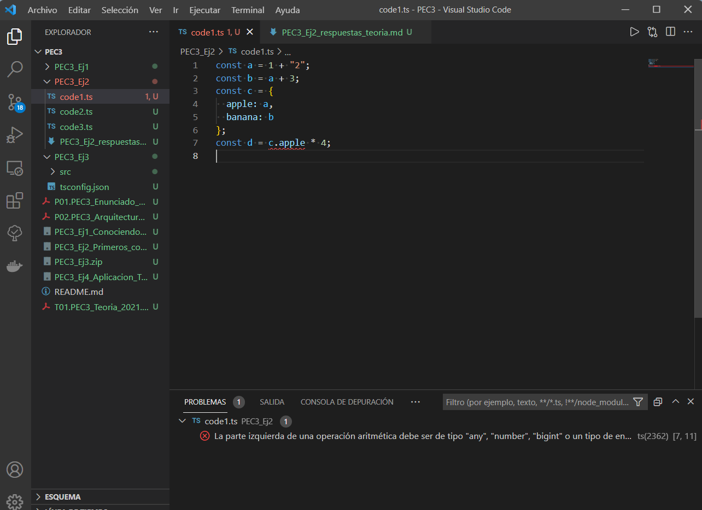
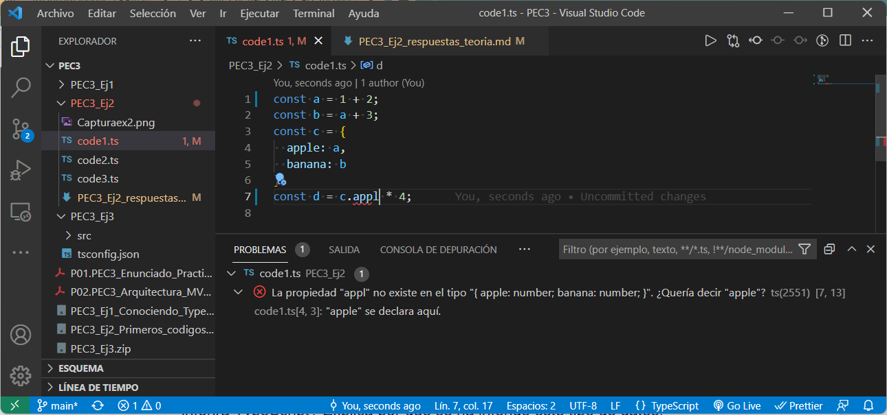

El error viene dado por cambiar un valor numérico a uno de tipo texto. A través de TypeScript te muestra donde está el error y porque sucede

En la segunda captura se puede ver que el nombre de la propiedad no existe, así que indica un error y te propone un autocompletado.

--------------------------------

1. (1 punto) Para cada uno de los valores del fichero code2.ts, ¿Qué tipo de datos inferirá TypeScript? Explica por qué se ha inferido este tipo de datos. 
    a. Tipo "nuber". Porque es un número.
    b. Tipo "string". Es una frase, pero comprende un solo elemento.
    c. Tipo "string". Una palabra que corresponde a un solo elemento.
    d. Tipo "booleon" en un array. Tres elementos de tipo "booleo" dentro de un array. TypeScript cogerá los tres valores como un array. Para utilizarlos necesitará concretar la posició del elemento que se quiere utilizar o vien se correran todos los valores. Ex: d[1]
    e. Una matriw con una property con el nombre de "type" y un valor tipo "string". Para seleccionar el valor se necesitará indicar la property. Ex: e.type
    f. Un array con el primer valor de tipo "number" y el segundo "bookleon". Como en el caso d.
    g. Tipo "number" en un array. Aunque solo tenga un elemento, TypeScript continuará tratando este valor como array. 
    h. Tipo "any". Es un valor no definido.

2. (1 punto) ¿Por qué se dispara cada uno de los errores del fichero code3.ts?  
    - En la línea 2, no se puede reasignar un valor a "i", porque está declarada como constante.
    - En la línea 6, no se puede asignar un "string" a un parámetro de tipo número. Esto sucede porque el método "push" introduce el parámetro al final del array y lo devuelve. "j" está asignada como array numérica y solo se pueden asignar valores de tipo numérico.
    - En la línea 8, se puede ver el nuevo tipo "never" introducido por TypeScript. Este indica que está seguro de que nunca ocurrirá. Un valor numérico no es algo que nunca ocurrirá.
    - En la línea 11, se intenta multiplicar un objeto tipo unknown con un valor numérico.

3. (0.5 puntos) ¿Cuál es la diferencia entre una clase y una interface en TypeScript?
A nivel de programación tradicional, las interfaces se utilizan para definir tipos de clases.
Tanto las clases como las interfaces son objetos que indican la lista de propiedades y métodos que contendrán, pero en las interfaces, las propiedades no pueden tener valores y los métodos no pueden tener código para su implementación, mientras que las clases si lo tienen.
En TypeScript a la hora de crear variables, se puede decir que su tipo es una interfaz declarada.

